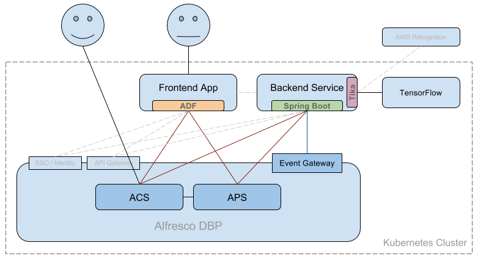
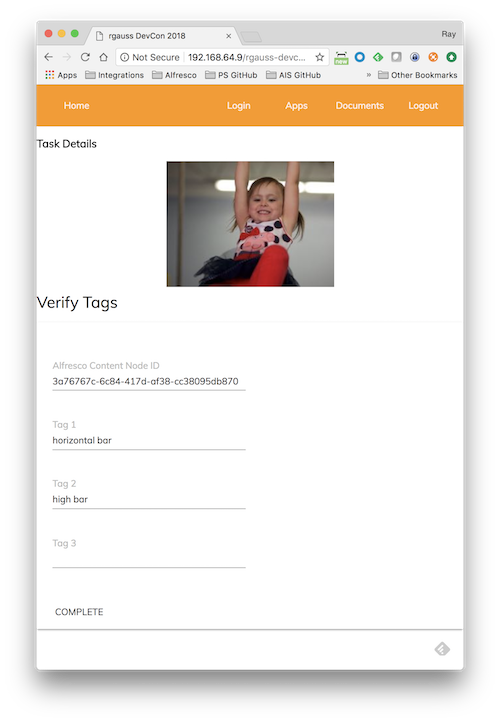

# Overview

In this exercise we'll develop a custom application on top of the Alfresco Digital Business Platform that uses image recognition to automatically tag images added to the Alfresco Content Services repository, then start a process that requests verification of tags by a human before actually associating them with the content in the repository.

# Architecture

## [Alfresco Content Services](https://www.alfresco.com/platform/content-services-ecm)

Various users will be adding content to the repository.

## Alfresco Event Gateway (Proof of Concept)

A component which enables event consumption from the Alfresco Digital Business Platform.

## [Backend Service](alfresco-devcon-2018-backend-service)

Monitors Alfresco events from the Event Gateway for addition of images, automatically tags them via image recognition, and starts an instance of the tag verification process.

It can also return a history of past tagging results via REST API.

### Technologies Involved

* [Apache Tika](https://tika.apache.org/)
* [TensorFlow](https://www.tensorflow.org/)
* [Apache Camel](http://camel.apache.org/)
* [Apache Kafka](https://kafka.apache.org/)
* [Spring Boot](https://projects.spring.io/spring-boot/)

## [Alfresco Process Services](https://www.alfresco.com/platform/process-services-bpm)

An Alfresco Process Services [process is defined](rgauss-devcon-2018-process) for designated users to verify the resulting tags.

## [UI Application](rgauss-devcon-2018-ui)

End-users access the UI to verify tags.

### Technologies Involved

* [Alfresco Application Development Framework](https://community.alfresco.com/community/application-development-framework)
* [NGINX Web Server](https://www.nginx.com/)

# Deployment

The example includes [Helm](https://helm.sh/) charts for easy deployment and management on Kubernetes.

Be sure to check out the [Alfresco Anaxes Shipyard](https://github.com/Alfresco/alfresco-anaxes-shipyard) and the related [Hello World example](https://github.com/Alfresco/alfresco-anaxes-hello-world).

# Setup

## 1. Alfresco DBP Deployment

See [alfresco-dbp-deployment](https://github.com/Alfresco/alfresco-dbp-deployment) (currently private unfortunately, but the other components are usuable against other forms of deployment as well)

## 2. Alfresco Event Gateway PoC

See [alfresco-event-gateway-poc-deployment](alfresco-event-gateway-poc-deployment)

## 3. Tika / TensorFlow Docker Image

See [Tika / TensorFlow](rgauss-devcon-2018-backend-service)

## 4. Create Tagging User

At the moment the example requires a user with the same username and password in both ACS and APS.

## 5. Import APS Process

See [rgauss-devcon-2018-process](rgauss-devcon-2018-process)

## 6. Backend Service

See [rgauss-devcon-2018-backend-service-deployment](rgauss-devcon-2018-backend-service-deployment)

## 7. UI

See [rgauss-devcon-2018-ui-deployment](rgauss-devcon-2018-ui-deployment)

# TODO

## API Gateway

All REST calls from both the UI and backend service should go through the API Gateway rather than directly to individual services.

## SSO

The UI should redirect to the common auth service for login.

Both the UI and the backend service should obtain an 'external' token from the common auth service which can then be presented to the API Gateway which will exchange it for an 'internal' token to be passed to the consuming services within the DBP.

## Helm Improvements

A parent Helm chart could be developed which declares the backend service and UI as requirement charts, though in this case it might make more sense to keep them separate as they are not tightly coupled and could certainly have different lifecycles.

